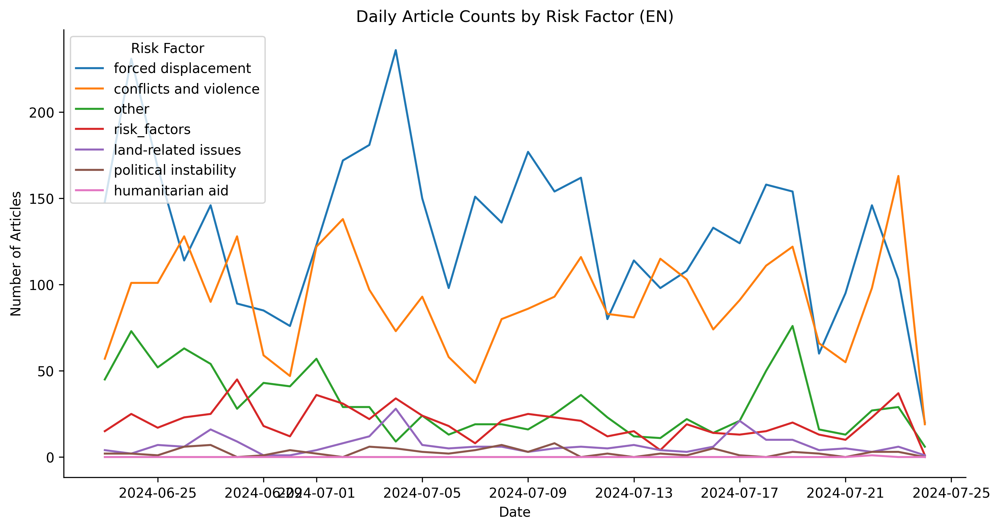
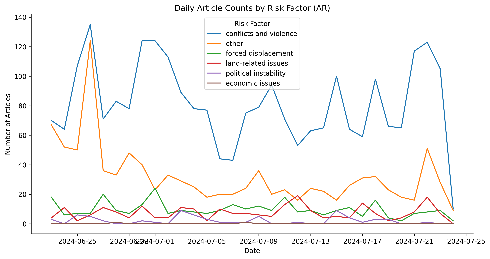
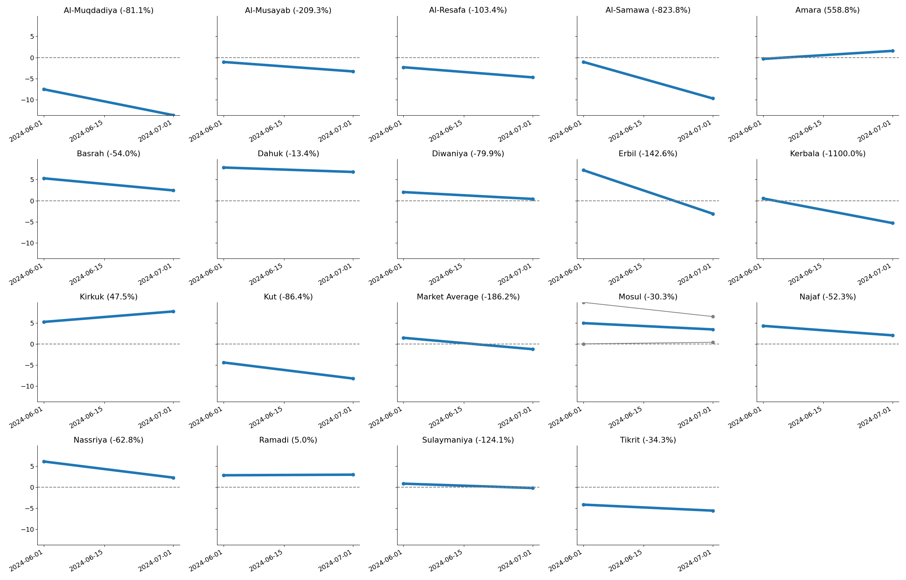

# DIME Take Home Assignment - Alex Rutherford
[see [GitHub repo for more details](https://github.com/alexrutherford/dime_take_home)]

## High Level Description

This repo uses the provided data files on

* [DS1] Taxonomy of terms related to food security in Arabic and English
* [DS2] Location information mapping variations of admin 0/1/2 names to unique ids
* [DS3] Corpus of English and Arabic news articles from 1 month in 2024

In order to investigate how food insecurity could be modelled, proxied, nowcasted or predicted using information extracted from DS3.  

The high level approach was to first carefully examine the data provided in order to understand any cleaning required or missing data. Comprehensive EDA at the beginning generally saves much time later. Given the limited time, sometimes quick decisions were made in how to pre-process data and inelegant code which is quick to write was used.

## Relevant Notebooks

- Notebook [00_eda.ipynb](notebooks/00_eda.ipynb) Examines the datasets for missing values, sparsity and volumes. Translates missing Arabic terms in taxonomy using an LLM. Writes some convenience files e.g. revese mapping of locations and ids.

- Notebook [01_processing.ipynb](notebooks/01_processing.ipynb) Extracts locations and risk factors from articles, drops those articles matchng neither.

- Notebook [02_analysis.ipynb](notebooks/02_analysis.ipynb) Looks at daily volumes of risk factors and admin 0/1/2 in both languages. Computes some simple correlations between these in each language.

- Notebook [03_validation.ipynb](notebooks/03_validation.ipynb) Quickly looks at some potential sources of ground truth data and explores WB monthly food price indicators.

## Findings & Steps Taken

- **Arabic terms in DS1 were missing** These were filled in using an LLM.
- **English and Arabic corpora comparable** The daily volume of articles and article lengths were similar.
- **Taxonomy in DS1 is sparse** Only a small proportion of articles matched food security taxonomy: 90.6% and 94.9% missing in English and Arabic corpora respectively. However > 90% matched some location strings. This suggests that the taxonomy could be expanded to make more matches.
- **Limited date range** The corpora in DS3 are taken from June and July 2024. This gives 30 days of data which (i) limits potential for observing meaningful differences over time as food insecurity changes slowly and (ii) limits ability to construct time series of changes to compare to ground truth data
- **Most location matches were at admin 2 level**
- **Some noisy taxonomy terms** The Jordanian admin 2 division 'هیت' may transliterate as 'heet' or 'hit' leading to many false positives. Locations could be more carefully matches by using Named Entity Extraction to disambiguate 'hit' as the location and 'hit' as the verb.
- **Prevalence of risk fctors differed between corpora** In the English corpus _forced displacement_ and _conflict and violence_ were the dominant risk factors. Whereas in the AR corpus, _forced displacement_ appeared much less. This demonstrates the potential biases that are present in news articles and which will lead to varying emphaseses from different sources. 

- **Content of articles similar between languages** The daily time series of appearances of risk factors in EN/AR were moderately correlated: 

| Category                  | Correlation |
|----------------------------|-------------|
| forced displacement        | 0.22        |
| conflicts and violence     | 0.50        |
| other                      | 0.55        |
| land-related issues        | 0.23        |
| political instability      | 0.28        |

- **Admin 2 level names appear much more frquently than admin 2** Surprisingly, in both AR and EN news articles most admin 2 locations appeared more than once, compred to admin 1 locations. One possible approach could be to aggregate mentions of admin 2 locations to their parent admin 1 location if required to overcome sparsity and/or to match ground truth data available only at admin 1 level.

|           | % Non-zero Admin Level 2 (EN corpus) | % Non-zero Admin Level 2 (AR corpus) |
|-----------|---------------------------------------|---------------------------------------|
| iq        | 38.1%                                | 52.4%                                |
| jo        | 23.8%                                | 34.9%                                |
| lb        | 63.0%                                | 88.9%                                |
| sy        | 51.5%                                | 74.2%                                |
| ps        | 93.8%                                | 93.8%                                |

- **Potential ground truth data available** World Bank provides [estimated food price data](https://microdata.worldbank.org/index.php/catalog/4483/get-microdata) on a sub-national basis including in Iraq, Lebanon and Syria. This has monthly frequency and includes variables such as food price inflation. This could potentially be used to validate or test a predictive model based on information extracted form the news corpus.

## Future Work

There is much that could be improved with more time.

- Without knowing where the taxonomy terms came from, it is likely that it could be augmented using a snowball approach or keyword expansion. i.e. look for new n-grams which coincide uniquely with n-grams in the taxonomy.

- Instead of using keyword matching, use an LLM to tag articles with risk factors in either (i) a zero shot fashion, possibly using official definitions of food insecurity terms or (ii) a few-shot learning approach with some examples of articles and their tags or (iii) a supervised-fine tuning approach in which the LLM is fine-tuned on articles and tags. Note that these would need to be evaluated.

- In some information environments, much news is produced and consumed in other formats than text i.e. video and audio and through non-mainstream channels e.g. blogs/social media. 

- The most important task is validation of the signal extracted from the news articles using some ground truth data. This would need to overlap in the time period and countries and be at sub-national granularity for operational utility. It is unlikely that the frequency would be more than monthly which is challenging with only 1 month of text corpus data. Instead of calculating time-series correlations, admin 1/2 regions could be ranked on the basis of food security indicators and compared to rankings based on matches in news articles.

- Much of the code is copy-pasted to repeat for Arabic and English. Ideally this would all be wrapped in a function with a language flag.

- The most useful signal from the news articles is likely to be when the _proportion_ of articles tagged with a location that matches the taxonomy increases (rather than simply the number matching a locaiton and taxonomy). Some correction based on the population or population density of the administrative division could be appropriate.

- There are many potential ways to deal with the two separate corpora. The simplest might be to convert daily volumes to z-scores and combining: `z_total(t) = z_en(t) + z_ar(t)`.
